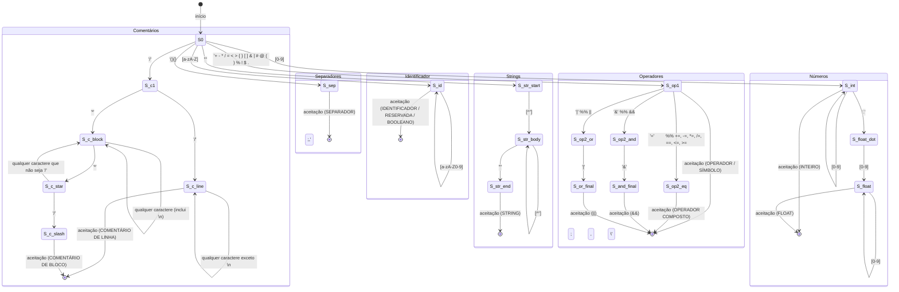

# Diagrama AFD final

```mermaid
stateDiagram-v2
    [*] --> S0 : início

    state "Identificador" as ID {
        S0 --> S_id : [a-zA-Z]
        S_id --> S_id : [a-zA-Z0-9]
        S_id --> [*] : aceitação (IDENTIFICADOR / RESERVADA / BOOLEANO)
    }

    state "Números" as NUM {
        S0 --> S_int : [0-9]
        S_int --> S_int : [0-9]
        S_int --> S_float_dot : '.'
        S_int --> [*] : aceitação (INTEIRO)
        S_float_dot --> S_float : [0-9]
        S_float --> S_float : [0-9]
        S_float --> [*] : aceitação (FLOAT)
    }

    state "Strings" as STR {
        S0 --> S_str_start : '"'
        S_str_start --> S_str_body : [^"]
        S_str_body --> S_str_body : [^"]
        S_str_body --> S_str_end : '"'
        S_str_end --> [*] : aceitação (STRING)
    }

    state "Operadores" as OP {
        %% Operadores de 1 caractere
        S0 --> S_op1 : '+ - * / = < > { } [ ] & | # @ ( ) % ! $ . ; , \\'

        S_op1 --> S_op2_eq : '='         %% +=, -=, *=, /=, ==, <=, >=
        S_op1 --> S_op2_and : '&'        %% &&
        S_op1 --> S_op2_or : '|'         %% ||

        S_op1 --> [*] : aceitação (OPERADOR / SÍMBOLO)
        S_op2_eq --> [*] : aceitação (OPERADOR COMPOSTO)
        S_op2_and --> S_and_final : '&'
        S_and_final --> [*] : aceitação (&&)
        S_op2_or --> S_or_final : '|'
        S_or_final --> [*] : aceitação (||)
    }

    state "Separadores" as SEP {
        S0 --> S_sep : '(){};,'
        S_sep --> [*] : aceitação (SEPARADOR)
    }

    state "Comentários" as COM {
        S0 --> S_c1 : '/'
        S_c1 --> S_c_line : '/'
        S_c1 --> S_c_block : '*'

        %% Linha
        S_c_line --> S_c_line : qualquer caractere exceto \n
        S_c_line --> [*] : aceitação (COMENTÁRIO DE LINHA)

        %% Bloco
        S_c_block --> S_c_block : qualquer caractere (inclui \n)
        S_c_block --> S_c_star : '*'
        S_c_star --> S_c_slash : '/'
        S_c_star --> S_c_block : qualquer caractere que não seja '/'
        S_c_slash --> [*] : aceitação (COMENTÁRIO DE BLOCO)
    }
```
