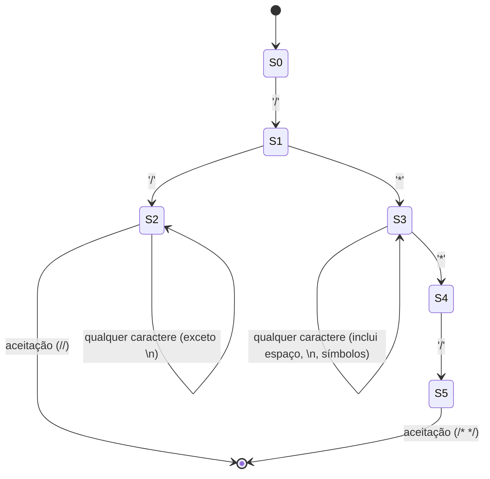

# Comentários

Nossa estrutura de comentários é semelhante ao C# sendo:

```cs
    // Comentário
    /*
        Comentário
        Comentário
    */
```


```mermaid
stateDiagram-v2
[*] --> S0

    S0 --> S1: '/'
    S1 --> S2: '/'
    S1 --> S3: '*'

    %% Comentário de linha //
    S2 --> S2: qualquer caractere (exceto \n)
    %% estado final

    %% Comentário de bloco /* */
    S3 --> S3: qualquer caractere (inclui espaço, \n, símbolos)
    S3 --> S4: '*'
    S4 --> S5: '/'

    %% estados finais
    S2 --> [*]: aceitação (//)
    S5 --> [*]: aceitação (/* */)
```
