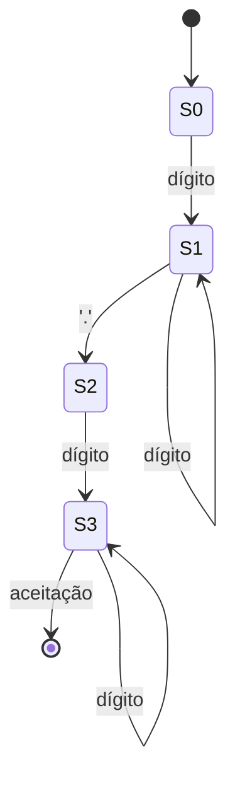

# Floats

Nossa estrutura de floats é padrão sendo:

```cs
    1.0
    4.5
    123.40
    ...
```


```mermaid
stateDiagram-v2
    [*] --> S0
    S0 --> S1: dígito
    S1 --> S1: dígito
    S1 --> S2: '.'
    S2 --> S3: dígito
    S3 --> S3: dígito
    S3 --> [*]: aceitação
```
