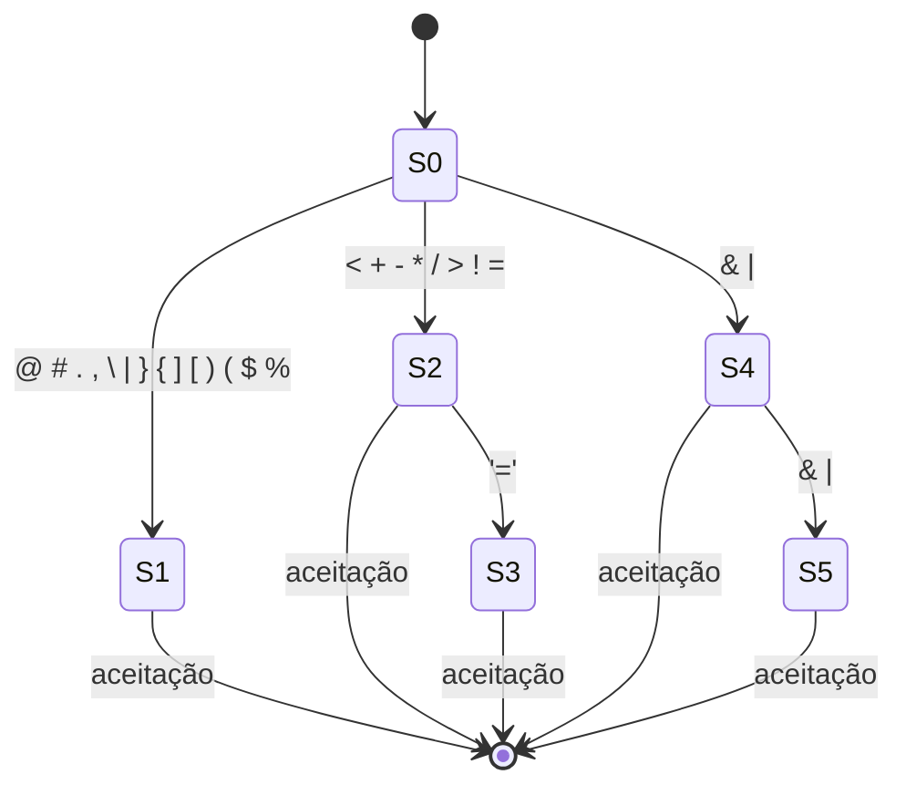

# Operadores e simbolos

Nossa estrutura aceita os seguintes:

```cs
    +, -, *, /, =, <, >, {, }, [, ], &, |
    #, @, (, ), %, !, $, (,), (.), :, ;,
    <=, =>, +=, -=, *=, /=, &&, ||, \
```


```mermaid
stateDiagram-v2
    [*] --> S0

    %% Operadores de 1 char
    S0 --> S1: @ # . , \ | } { ] [ ) ( $ %

    %% Operadores relacionais / aritméticos
    S0 --> S2: < + - * / > ! =
    S2 --> S3: '='
    S1 --> [*]: aceitação
    S2 --> [*]: aceitação
    S3 --> [*]: aceitação

    %% Lógicos duplos
    S0 --> S4: & |
    S4 --> S5: & |
    S4 --> [*]: aceitação
    S5 --> [*]: aceitação

```
