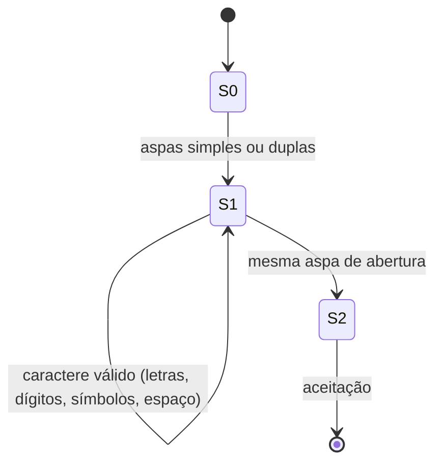

# Operadores e simbolos

Nossa estrutura tanto com aspas duplas, quanto com aspas simples:

```cs
   "Teste" ou 'Teste'
```


```mermaid
stateDiagram-v2
    [*] --> S0
    S0 --> S1: aspas simples ou duplas
    S1 --> S1: caractere válido (letras, dígitos, símbolos, espaço)
    S1 --> S2: mesma aspa de abertura
    S2 --> [*]: aceitação

```
